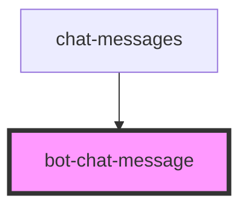

# bot-chat-message

<!-- Auto Generated Below -->

## Properties

| Property  | Attribute | Description | Type         | Default     |
| --------- | --------- | ----------- | ------------ | ----------- |
| `isLast`  | `is-last` |             | `boolean`    | `undefined` |
| `message` | --        |             | `BotMessage` | `undefined` |

## Events

| Event           | Description | Type                      |
| --------------- | ----------- | ------------------------- |
| `feedbackGiven` |             | `CustomEvent<BotMessage>` |

## Dependencies

### Used by

 - [chat-messages](../chat-messages)

### Graph

----------------------------------------------

*Built with [StencilJS](https://stenciljs.com/)*
