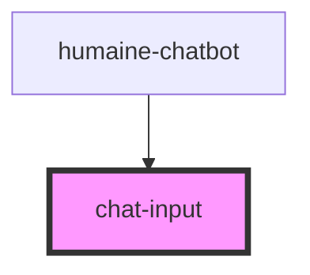

# chat-input

<!-- Auto Generated Below -->

## Events

| Event                  | Description | Type                           |
| ---------------------- | ----------- | ------------------------------ |
| `focusChanged`         |             | `CustomEvent<boolean>`         |
| `inputActionSubmitted` |             | `CustomEvent<UserInputAction>` |

## Dependencies

### Used by

 - [humaine-chatbot](../humaine-chatbot)

### Graph

----------------------------------------------

*Built with [StencilJS](https://stenciljs.com/)*
