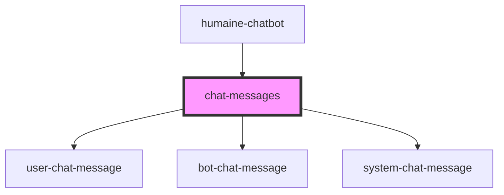

# chat-messages

<!-- Auto Generated Below -->

## Properties

| Property   | Attribute | Description | Type        | Default     |
| ---------- | --------- | ----------- | ----------- | ----------- |
| `messages` | --        |             | `Message[]` | `undefined` |

## Events

| Event              | Description | Type                      |
| ------------------ | ----------- | ------------------------- |
| `feedbackReceived` |             | `CustomEvent<BotMessage>` |

## Dependencies

### Used by

 - [humaine-chatbot](../humaine-chatbot)

### Depends on

- [user-chat-message](../user-chat-message)
- [bot-chat-message](../bot-chat-message)
- [system-chat-message](../system-chat-message)

### Graph

----------------------------------------------

*Built with [StencilJS](https://stenciljs.com/)*
