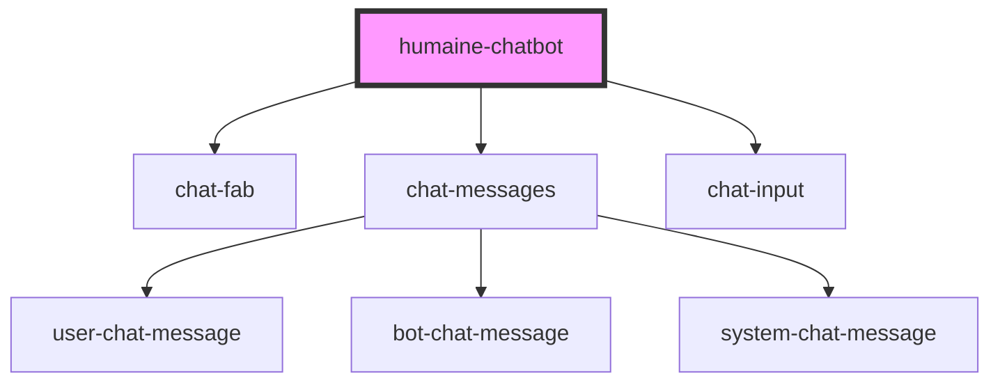

# humaine-chatbot

<!-- Auto Generated Below -->

## Properties

| Property     | Attribute     | Description | Type     | Default     |
| ------------ | ------------- | ----------- | -------- | ----------- |
| `apiKey`     | `api-key`     |             | `string` | `undefined` |
| `assetsPath` | `assets-path` |             | `string` | `undefined` |
| `baseUrl`    | `base-url`    |             | `string` | `undefined` |
| `langCode`   | `lang-code`   |             | `string` | `undefined` |

## Dependencies

### Depends on

- [chat-fab](../chat-fab)
- [chat-messages](../chat-messages)
- [chat-input](../chat-input)

### Graph

----------------------------------------------

*Built with [StencilJS](https://stenciljs.com/)*
