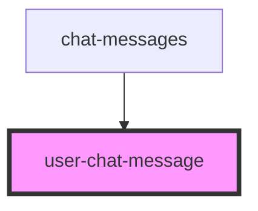

# user-chat-message

<!-- Auto Generated Below -->

## Properties

| Property  | Attribute | Description | Type          | Default     |
| --------- | --------- | ----------- | ------------- | ----------- |
| `message` | --        |             | `UserMessage` | `undefined` |

## Dependencies

### Used by

 - [chat-messages](../chat-messages)

### Graph

----------------------------------------------

*Built with [StencilJS](https://stenciljs.com/)*
